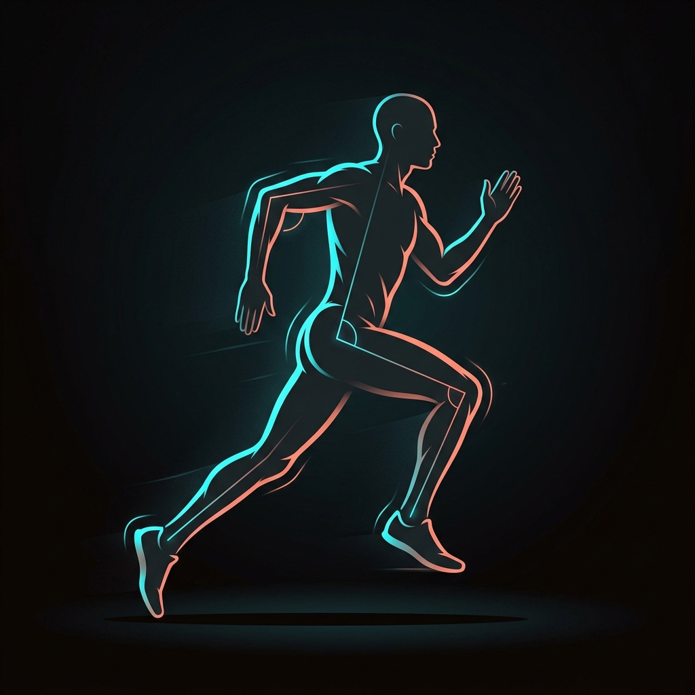

# FormForward — AI Running Form Coach

> **Seamlessly chain biomechanical research → computer vision → Gemma 4 coaching into a single-click form optimization pipeline.**



---

## 🏃 What is FormForward?

FormForward is an AI-powered running form analysis platform that combines:

- **Wearable data analysis** (Garmin CSV/GPX imports)
- **Computer vision pose estimation** (MediaPipe 33-point skeleton detection)
- **Research paper extraction** (PaddleOCR for biomechanical PDFs)
- **Web scraping** (Scrapy-powered article ingestion)
- **LLM coaching** (Gemma 4 via Ollama — fully local inference)

All processing happens **locally on your machine** — your data never leaves your device.

---

## ⚡ Key Feature: Unified Pipeline

The core innovation is the **unified `/api/analyze-form` endpoint** that chains:

```
PDF Upload → PaddleOCR Extraction → Prompt Construction → Gemma 4 → Optimal Form Output
```

One click produces:
- Personalized form correction cues
- Drill prescriptions with sets/reps
- Current vs. optimal angle comparisons for each body part
- Prioritized form adjustments (high/medium/low)
- Research-backed recommendations

---

## 🚀 Quick Start

### Prerequisites

| Tool | Version | Purpose |
|------|---------|---------|
| Node.js | 20+ | Backend server |
| Python | 3.10+ | PDF scraping (PaddleOCR) |
| Ollama | Latest | Local Gemma 4 inference |

### 1. Install dependencies

```bash
# Node dependencies
npm install

# Python dependencies (for PDF analysis)
pip install paddleocr pdf2image

# Install Gemma 4 model
ollama pull gemma4:latest
```

### 2. Start the server

```bash
node server.js
```

### 3. Open in browser

Navigate to [http://localhost:5173](http://localhost:5173)

---

## 🧪 Usage

### Dashboard
- Upload CSV/GPX wearable data or use the built-in samples
- View form health score, breakdown events, and coaching previews
- See the **Optimal Form Blueprint** with the AI-generated runner image

### Video Analysis
- Upload a running video (MP4) or use live camera tracking
- MediaPipe detects 33 body landmarks and computes 12 biomechanical angles
- 3-tier grading (Good / Needs Improvement / Bad) for each metric

### Research Ingestion
- Paste URLs to scrape running form articles
- Upload biomechanical research PDFs for PaddleOCR extraction

### Full Pipeline
1. Upload a PDF (optional) in the Research tab
2. Upload a video (optional) in the Video tab
3. Click **⚡ Run Full Pipeline** on the dashboard
4. The pipeline extracts PDF text, combines with video analysis + run metrics, queries Gemma 4, and renders personalized form adjustments with angle overlays

---

## 📁 Project Structure

```
Rockathon-2026/
├── index.html              # Main SPA entry point
├── server.js               # Node.js backend (API endpoints)
├── package.json            # Node dependencies
├── PRD.md                  # Product Requirements Document
├── src/
│   ├── app.js              # Frontend application logic
│   ├── vision.js           # MediaPipe pose estimation module
│   ├── styles.css           # Design system (dark mode, Electric Cyan)
│   ├── optimal_form.png    # AI-generated optimal form runner image
│   └── static.test.js      # Static file serving tests
├── scripts/
│   └── scrapers/
│       ├── pdf_scraper.py   # PaddleOCR PDF text extraction
│       └── web_scraper.py   # Scrapy web article scraper
├── data/                    # Data directory for processed outputs
└── formforward_app/         # Flutter companion app (iOS/Android)
```

---

## 🔌 API Endpoints

| Endpoint | Method | Description |
|----------|--------|-------------|
| `/api/analyze-form` | POST | **Unified pipeline**: PDF → Gemma 4 → form output |
| `/api/gemma` | POST | Direct Ollama/Gemma proxy |
| `/api/research` | POST | Web URL scraping |
| `/api/scrape-pdf` | POST | Standalone PDF OCR extraction |

### Example: Unified Pipeline

```bash
curl -X POST http://localhost:5173/api/analyze-form \
  -H "Content-Type: application/json" \
  -d '{
    "pdf_data": { "file_name": "paper.pdf", "base64_data": "..." },
    "video_frames": [{ "base64": "..." }],
    "run_analysis": { ... },
    "research_sources": [...],
    "model": "gemma4:latest"
  }'
```

---

## 🎨 Design System

- **Theme**: Dark mode with Electric Cyan (`#00e5ff`) accent
- **Typography**: Inter font family
- **Effects**: Glassmorphism, micro-animations, gradient highlights
- **Layout**: Tab-based SPA with responsive grid system

---

## 🔒 Privacy

- **100% local processing** — no cloud dependencies
- **Ollama inference** — LLM runs on your hardware
- **No telemetry** — zero data collection
- **Proxy wording** — AI uses cautious language, never diagnoses injuries

---

## 📄 License

MIT

---

## 🙏 Acknowledgments

- [POSE Method](https://posemethod.com) by Dr. Nicholas Romanov
- [MediaPipe](https://mediapipe.dev) by Google
- [PaddleOCR](https://github.com/PaddlePaddle/PaddleOCR) by Baidu
- [Ollama](https://ollama.com) for local LLM inference
- [Gemma 4](https://ai.google.dev/gemma) by Google DeepMind
